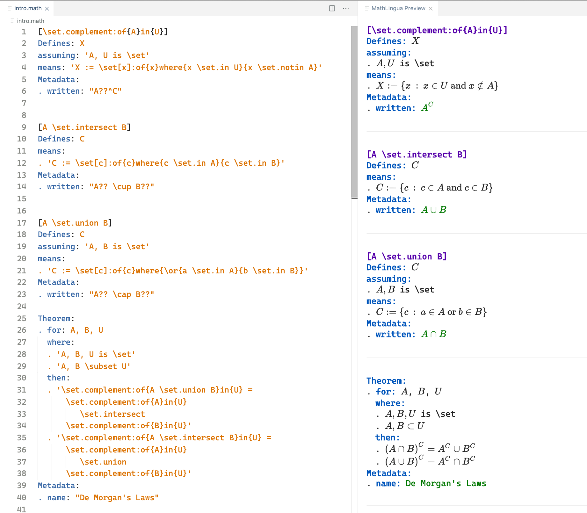

# Mathlingua Language Support

This is the official Visual Studio Code extension to provide language support for the [Mathlingua](https://www.mathlingua.org/) language.  It is the recommended tool for contributing math knowledge to the [Mathlore Vault](https://github.com/DominicKramer/mathlore-vault).

## Features

Supports syntax highlighting, auto-analysis, autocomplete, and rendering of MathLingua documents (with a `.math` extension).  Any parse errors are displayed within the current file on save, and any signatures that are used, but have not been defined, are marked with a warning.

Furthermore, entering the `mathlingua` command at the command palette will manually open a preview window that renders the current MathLingua document.  In addition, when a `.math` file is opened, the preview window is automatically opened.

The following configuration options are supported:
- **mathlingua.fontFamily**
  - The font used when rendering MathLingua code.
  - Defaults to the editor's font family.
- **mathlingua.scale**
  - The amount to scale the rendered MathLingua code's font.
  - Defaults to `1.5`.
- **useBoldHeaders**
  - Specifies whether or not headers in MathLingua are rendered as bold.
  - Defaults to `false`.

## Release Notes

### 0.10.2 (2020-07-04)
- Update the readme to describe how to use this extension with mathlore.org.

### 0.10.1 (2020-07-02)
- Address an issue where commands containing the text `is` (such as `\exists`) were not rendered correctly.
- Changed the default configuration value of `mathlingua.useBoldHeaders` to `false`.

### 0.10.0 (2020-07-01)
- Add configuration options.

### 0.9.2 (2020-07-01)
- Add autocomplete for `expands:as:`.
- Greek letters and names with subscripts are rendered correctly in TexTalk.

### 0.9.1 (2020-06-29)
- Update the preview image path in the readme.

### 0.9.0 (2020-06-29)
- Support `A??` and `A{...}??` 'written as' forms.
- Improve the spacing and rendering in the preview window.
- Fixed some issues related to opening the preview window.

### 0.8.0 (2020-06-27)
- In addition to statements, text entries, and written as entries are rendered as LaTeX.
- All text and statements have tooltips that show their original unrendered text.
- The preview window is only automatically opened if there is `.math` file open.

### 0.7.3 (2020-06-27)
- Fix an issue where named groups with multiple args are now supported.

### 0.7.2 (2020-06-26)
- The preview window is now automatically displayed when opening a `.math` file.

### 0.7.1 (2020-06-26)
- Rendered views preserve item order.
- Fixed an issue expanding "written as" forms.
- Improved font sizes.

### 0.7.0 (2020-06-25)
- Add support for rendering custom infix operators.  (For example render `x \set.in X` as `x \in X`).
- Left justify rendered html.

### 0.6.0 (2020-06-11)
- Add support for rendering MathLingua documents.

### 0.5.1 (2020-06-10)
- Update the README.

### 0.5.0 (2020-06-10)
- Updated to reflect changes to MathLingua where `Theorem` is used instead of `Result` and `Resource` is used instead of `Source`.

### 0.4.0 (2020-05-20)
- Warnings are displayed for signatures that are used but have not been defined.

### 0.3.0 (2020-05-19)
- Parse errors are now displayed within the editor on save.

### 0.2.0 (2020-05-18)
- Autocomplete of `Defines:` and `Represents:` signatures has been added but only within the current file.  That is, if a signature is specified in file `a.math`, then file `b.math` does not yet know about it.

### 0.1.1 (2020-05-17)
- Included more keywords to identify the extension

### 0.1.0 (2020-05-17)
- Introduced syntax highlighting support
- Introduced autocompletion for structural components (i.e. not statements within single quotes)
